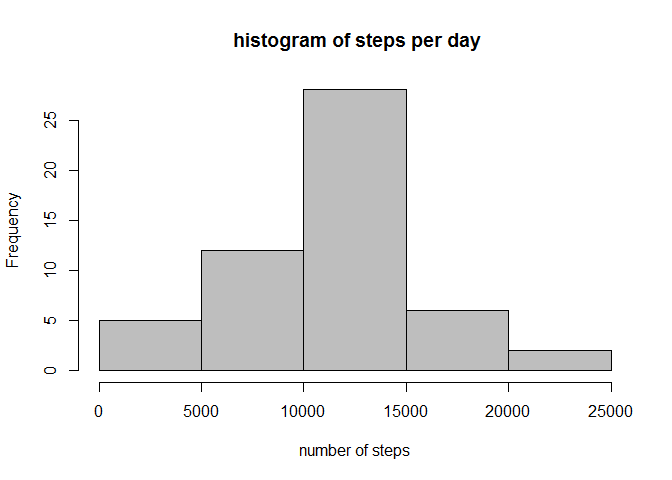
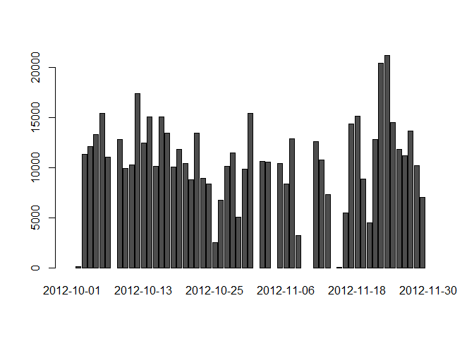
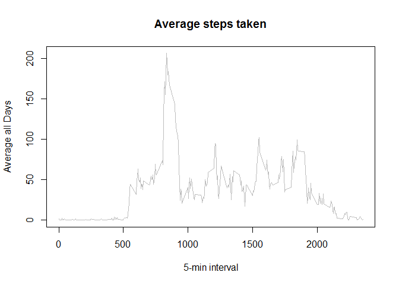
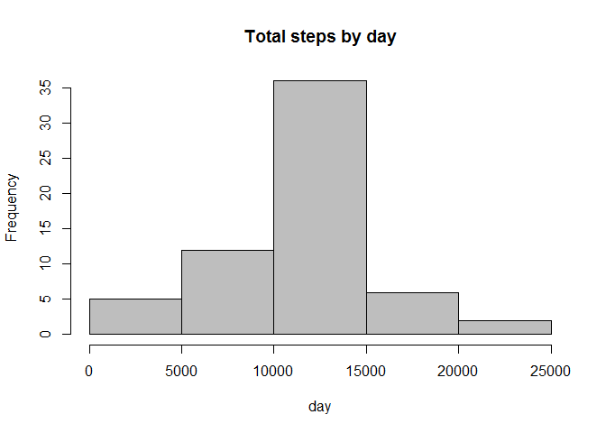

# Reproducible Research: Peer Assessment 1


## Loading and preprocessing the data

Loading the data.


```r
data <- read.csv("activity/activity.csv")
```
## What is mean total number of steps taken per day?

 Calculate the total number of steps taken per day.

 
 ```r
 stepsperday <- aggregate(data$steps, by=list(Category=data$date), FUN=sum)
 ```

 Make a histogram of the total number of steps taken each day
 
 
 ```r
 hist(stepsperday$x,main = " histogram of steps per day",xlab="number of steps",col = "grey")
 ```
 
 \
 
Make barplot of the total number of steps taken each day.


```r
 row.names(stepsperday)<-stepsperday[,1]
 stepsperday[,1]<-NULL
 barplot(t(as.matrix(stepsperday)))
```

\

Calculate and report the mean and median of the total number of steps taken per day.
 
 Mean:

 
 ```r
 mean(stepsperday$x,na.rm=TRUE)
 ```
 
 ```
 ## [1] 10766.19
 ```

 Median:
 
 
 ```r
 median(stepsperday$x,na.rm=TRUE)
 ```
 
 ```
 ## [1] 10765
 ```
## What is the average daily activity pattern?


Make a time series plot (i.e. type = "l") of the 5-minute interval (x-axis) and the average number of steps taken, averaged across all days (y-axis)
 

```r
 averageNumber <- tapply(data$steps, data$interval, mean, na.rm = TRUE)
 plot(row.names(averageNumber), averageNumber, type = "l", xlab = "5-min interval",ylab = "Average all Days", main = "Average steps taken", col = "grey")
```

\

 Which 5-minute interval, on average across all the days in the dataset, contains the maximum number of steps?
 
 
 ```r
 names(which.max(averageNumber))
 ```
 
 ```
 ## [1] "835"
 ```


## Imputing missing values


 Calculate and report the total number of missing values in the dataset (i.e. the total number of rows with NAs)
 
 
 ```r
 fillmissingvalues <- sum(is.na(data))
 fillmissingvalues
 ```
 
 ```
 ## [1] 2304
 ```

Devise a strategy for filling in all of the missing values in the dataset. 
 
 
 ```r
 avgnoofsteps <- aggregate(steps ~ interval, data = data, FUN = mean)
 fillmissingvalues <- numeric()
 for (i in 1:nrow(data)) {
     obs <- data[i, ]
     if (is.na(obs$steps)) {
         steps <- subset(avgnoofsteps, interval == obs$interval)$steps
     } else {
         steps <- obs$steps
     }
     fillmissingvalues <- c(fillmissingvalues, steps)
 }
 ```
 Create a new dataset that is equal to the original dataset but with the missing data filled in.
 
 
 ```r
 datawmv <- data
 datawmv$steps <- fillmissingvalues
 ```
 
 Make a histogram of the total number of steps taken each day and Calculate and report the mean and median total number of steps taken per day. 
 
 
 ```r
 stepsperday_wmv <- aggregate(steps ~ date, data = datawmv, sum, na.rm = TRUE)
 ```
 Histogram:
 
 
 ```r
 hist(stepsperday_wmv$steps, main = "Total steps by day", xlab = "day", col = "grey")
 ```
 
 \
 
 Mean  without missing values:
 
 
 ```r
 mean(stepsperday_wmv$steps)
 ```
 
 ```
 ## [1] 10766.19
 ```
 
 Median without missing values :
 
 
 
 ```r
 median(stepsperday_wmv$steps)
 ```
 
 ```
 ## [1] 10766.19
 ```


## Are there differences in activity patterns between weekdays and weekends?

 
 Create a new factor variable in the dataset with two levels - "weekday" and "weekend" indicating whether a given date is a weekday or weekend day.
 
 
 ```r
 library(lattice)
 
 getdays <- weekdays(as.Date(data$date,"%Y-%m-%d"))
 
 factorvar_day <- vector()
 
 for (i in 1:nrow(data)) {
     if (getdays[i] == "Saturday") {
         factorvar_day[i] <- "Weekend"
     } else if (getdays[i] == "Sunday") {
         factorvar_day[i] <- "Weekend"
     } else {
         factorvar_day[i] <- "Weekday"
     }
 }
 
 data$factorvar_day <- factorvar_day
 data$factorvar_day <- factor(data$factorvar_day)
 
 stepsPerDay <- aggregate(steps ~ interval + factorvar_day, data = data, mean)
 names(stepsPerDay) <- c("interval", "factorvar_day", "steps")
 ```
 Make a panel plot containing a time series plot (i.e. type = "l") of the 5-minute interval (x-axis) and the average number of steps taken, averaged across all weekday days or weekend days (y-axis). 
 
 
 ```r
 xyplot(steps ~ interval | factorvar_day, stepsPerDay, type = "l", layout = c(1, 2), 
     xlab = "Interval", ylab = "Number of steps")
 ```
 
 \
  
